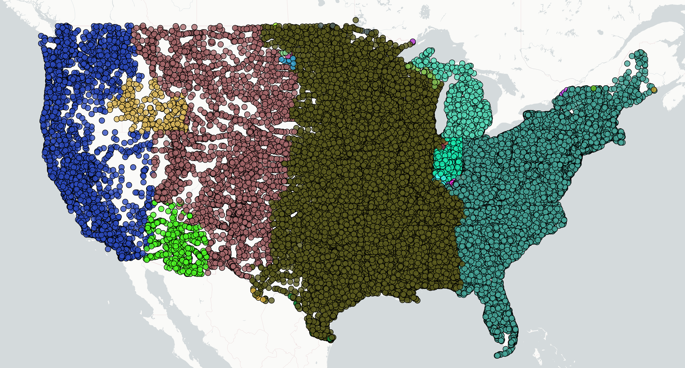

# leaflet-test-timezones
This is simply a project for me to test out using Leaflet in a couple hours. Not practically useful. It consumes data on US cities from simplemaps and creates points for each colored according to their timezone.

## How to run
- Clone this repository
- Download the US Cities data from simplemaps [here](https://simplemaps.com/data/us-cities)
- Move the downloaded csv into the cloned repository directory and save it as `uscities.csv`
- Install with `npm install`
- Build the geojson file with `npm run build:geojson`
- Build the bundle with `npm run build:index`
- Open `index.html` with your favorite browser
